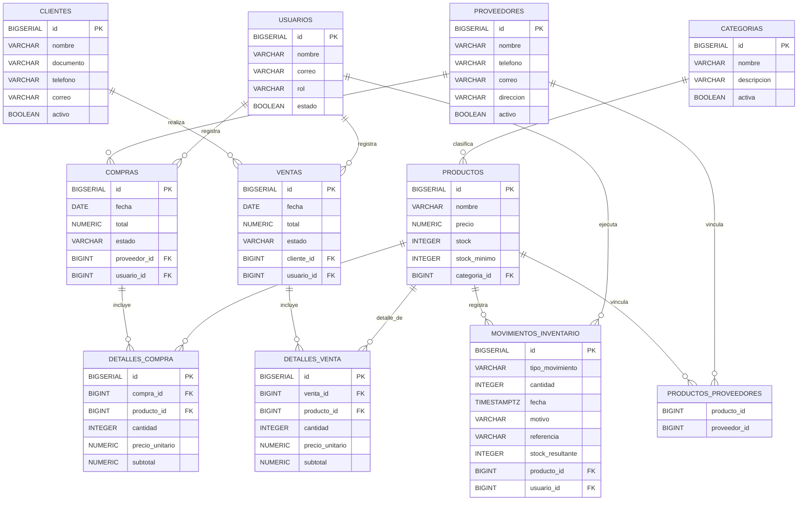

# Papelería Inteligente

Software web para una papelería pequeña o mediana con control de productos, categorías, proveedores, compras, ventas, clientes, inventario, movimientos de stock, reportes y predicción de demanda por regresión lineal.

## Tecnologías

- Java 21
- Spring Boot 3.x
- Spring Web
- Spring Data JPA / Hibernate
- Spring Security 6 + JWT
- Bean Validation
- Thymeleaf, HTML, CSS y JavaScript
- PostgreSQL
- Swagger/OpenAPI con Springdoc
- Maven

## Arquitectura

El proyecto quedó organizado por capas:

```text
com.example.parcial2
├── config
├── controller
├── dto
│   ├── request
│   └── response
├── entity
├── exception
├── mapper
├── repository
├── security
└── service
```

Flujo principal:

```text
Usuario -> Thymeleaf/JS -> Controller -> Service -> Repository -> PostgreSQL
```

Los controladores reciben DTOs de entrada y devuelven DTOs de salida. Las entidades JPA no se exponen directamente por la API.

## Módulos implementados

| Módulo | Funcionalidad principal |
|---|---|
| Autenticación | Login y signup con JWT. |
| Usuarios y roles | Roles `ADMIN` y `EMPLEADO`. |
| Productos | Crear, consultar, actualizar y desactivar productos. |
| Categorías | Clasificación de productos. |
| Proveedores | Gestión de proveedores. |
| Compras | Registro de compras y aumento automático de inventario. |
| Ventas | Registro de ventas, validación de stock y descuento automático. |
| Clientes | Registro de clientes frecuentes. |
| Inventario | Consulta de stock, bajo stock, ajustes y movimientos. |
| Reportes | Dashboard con ventas del día, ingresos del mes y productos más vendidos. |
| Predicción | Regresión lineal por mínimos cuadrados para estimar demanda futura. |

## Roles y permisos

| Funcionalidad | ADMIN | EMPLEADO |
|---|---:|---:|
| Iniciar sesión | Sí | Sí |
| Consultar productos | Sí | Sí |
| Crear/editar/desactivar productos | Sí | No |
| Consultar inventario | Sí | Sí |
| Registrar ventas | Sí | Sí |
| Gestionar proveedores | Sí | No |
| Registrar compras | Sí | No |
| Ver reportes | Sí | No |
| Ejecutar predicción | Sí | No |
| Ajustar inventario manualmente | Sí | No |

## Base de datos

El dump completo está en:

```text
database/dump_papeleria_inteligente.sql
```

Diagrama ER de la base de datos:



Ejecutar desde PostgreSQL con un usuario con permisos para crear bases de datos:

```bash
psql -U postgres -f database/dump_papeleria_inteligente.sql
```

El dump crea la base:

```text
papeleria_inteligente
```

También crea datos iniciales de usuarios, categorías, proveedores, productos, compras, ventas y movimientos de inventario.

## Credenciales de prueba

| Rol | Correo | Contraseña |
|---|---|---|
| ADMIN | `admin@papeleria.com` | `Admin123*` |
| EMPLEADO | `empleado@papeleria.com` | `Empleado123*` |

## Configuración

Archivo principal:

```text
src/main/resources/application.properties
```

Variables configurables:

```properties
DB_URL=jdbc:postgresql://localhost:5432/papeleria_inteligente
DB_USERNAME=postgres
DB_PASSWORD=postgres
JWT_SECRET=cGFwZWxlcmlhLWludGVsaWdlbnRlLTIwMjYtc2VjcmV0LWtleS1zaXN0ZW1hLWp3dC0zMg==
JWT_EXPIRATION=86400000
```

## Ejecución local

1. Instalar Java 21.
2. Instalar y levantar PostgreSQL.
3. Ejecutar el dump de base de datos.
4. Configurar usuario y contraseña de PostgreSQL en `application.properties` o variables de entorno.
5. Ejecutar:

```bash
./mvnw spring-boot:run
```

En Windows:

```powershell
.\mvnw.cmd spring-boot:run
```

6. Abrir:

```text
http://localhost:8080/app/login
```

Swagger:

```text
http://localhost:8080/swagger-ui.html
```

## Endpoints principales

Todas las rutas REST usan el prefijo `/api/v1`.

### Autenticación

| Método | Ruta | Rol |
|---|---|---|
| POST | `/api/v1/auth/login` | Público |
| POST | `/api/v1/auth/signup` | Público |

### Productos y categorías

| Método | Ruta | Rol |
|---|---|---|
| GET | `/api/v1/productos` | ADMIN / EMPLEADO |
| POST | `/api/v1/productos` | ADMIN |
| PUT | `/api/v1/productos/{id}` | ADMIN |
| DELETE | `/api/v1/productos/{id}` | ADMIN |
| GET | `/api/v1/categorias` | ADMIN / EMPLEADO |
| POST | `/api/v1/categorias` | ADMIN |

### Inventario

| Método | Ruta | Rol |
|---|---|---|
| GET | `/api/v1/inventario` | ADMIN / EMPLEADO |
| GET | `/api/v1/inventario/bajo-stock` | ADMIN / EMPLEADO |
| GET | `/api/v1/inventario/movimientos` | ADMIN / EMPLEADO |
| POST | `/api/v1/inventario/ajustes` | ADMIN |

### Ventas, compras, reportes y predicción

| Método | Ruta | Rol |
|---|---|---|
| POST | `/api/v1/ventas` | ADMIN / EMPLEADO |
| GET | `/api/v1/ventas` | ADMIN |
| POST | `/api/v1/compras` | ADMIN |
| GET | `/api/v1/compras` | ADMIN |
| GET | `/api/v1/reportes/dashboard` | ADMIN |
| GET | `/api/v1/predicciones/{productoId}` | ADMIN |

## Ejemplo de login

```json
{
  "correo": "admin@papeleria.com",
  "password": "Admin123*"
}
```

## Ejemplo de venta

```json
{
  "clienteId": 1,
  "fecha": "2026-05-18",
  "detalles": [
    {
      "productoId": 1,
      "cantidad": 2
    }
  ]
}
```

## Ejemplo de compra

```json
{
  "proveedorId": 1,
  "fecha": "2026-05-18",
  "detalles": [
    {
      "productoId": 1,
      "cantidad": 20,
      "precioUnitario": 3200
    }
  ]
}
```

## Predicción de demanda

Endpoint:

```text
GET /api/v1/predicciones/{productoId}?dias=7
```

El cálculo usa regresión lineal por mínimos cuadrados sobre el historial agrupado por fecha:

```text
y = mx + b
```

El sistema compara la demanda estimada contra el stock actual y devuelve una recomendación de compra.
