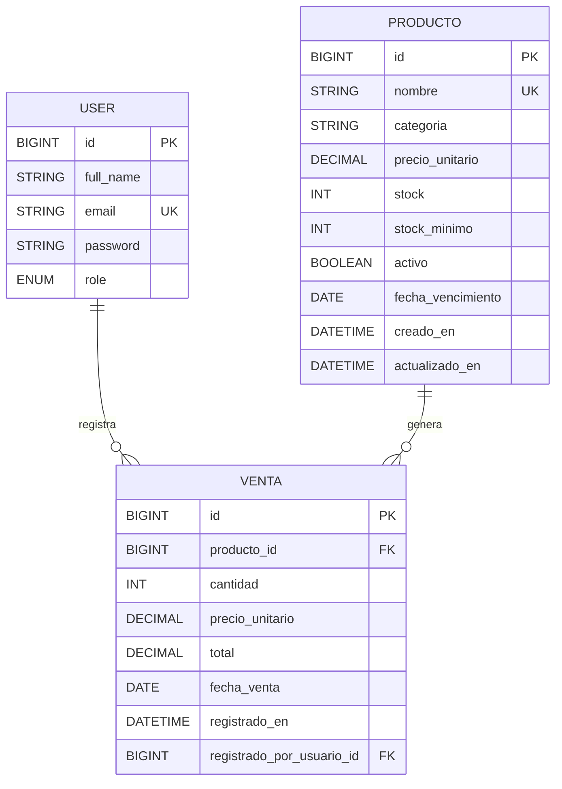

# Sistema de Gestion de Inventario y Ventas

Aplicacion web desarrollada con Spring Boot para administrar productos, registrar ventas y controlar inventario con autenticacion JWT y base de datos PostgreSQL.

## Resumen del sistema

El sistema esta enfocado en dos roles:

- `ADMIN`: puede crear, actualizar, consultar y desactivar productos, ademas de registrar y consultar ventas.
- `EMPLEADO`: puede consultar inventario y registrar ventas.

Flujo principal:

`Frontend` -> `Controller` -> `Service` -> `Repository` -> `PostgreSQL`

## Tecnologias

- Java 17
- Spring Boot 4
- Spring Web
- Spring Data JPA
- Spring Security
- JWT
- Thymeleaf
- PostgreSQL
- Maven

## Estructura general

```text
com.example.parcial2
├── config
├── controller
├── dto
│   ├── request
│   └── response
├── entity
├── exception
│   ├── custom
│   └── handler
├── mapper
├── repository
├── security
├── service
└── service.impl
```
## Base de datos

El dump completo está en:

```text
database/dump_papeleria_inteligente.sql
```

Diagrama ER de la base de datos:

```mermaid
erDiagram
  USUARIOS {
    BIGSERIAL id PK
    VARCHAR nombre
    VARCHAR correo
    VARCHAR rol
    BOOLEAN estado
  }

  CATEGORIAS {
    BIGSERIAL id PK
    VARCHAR nombre
    VARCHAR descripcion
    BOOLEAN activa
  }

  PROVEEDORES {
    BIGSERIAL id PK
    VARCHAR nombre
    VARCHAR telefono
    VARCHAR correo
    VARCHAR direccion
    BOOLEAN activo
  }

  CLIENTES {
    BIGSERIAL id PK
    VARCHAR nombre
    VARCHAR documento
    VARCHAR telefono
    VARCHAR correo
    BOOLEAN activo
  }

  PRODUCTOS {
    BIGSERIAL id PK
    VARCHAR nombre
    NUMERIC precio
    INTEGER stock
    INTEGER stock_minimo
    BIGINT categoria_id FK
  }

  PRODUCTOS_PROVEEDORES {
    BIGINT producto_id PK FK
    BIGINT proveedor_id PK FK
  }

  COMPRAS {
    BIGSERIAL id PK
    DATE fecha
    NUMERIC total
    VARCHAR estado
    BIGINT proveedor_id FK
    BIGINT usuario_id FK
  }

  DETALLES_COMPRA {
    BIGSERIAL id PK
    BIGINT compra_id FK
    BIGINT producto_id FK
    INTEGER cantidad
    NUMERIC precio_unitario
    NUMERIC subtotal
  }

  VENTAS {
    BIGSERIAL id PK
    DATE fecha
    NUMERIC total
    VARCHAR estado
    BIGINT cliente_id FK
    BIGINT usuario_id FK
  }

  DETALLES_VENTA {
    BIGSERIAL id PK
    BIGINT venta_id FK
    BIGINT producto_id FK
    INTEGER cantidad
    NUMERIC precio_unitario
    NUMERIC subtotal
  }

  MOVIMIENTOS_INVENTARIO {
    BIGSERIAL id PK
    VARCHAR tipo_movimiento
    INTEGER cantidad
    TIMESTAMPTZ fecha
    VARCHAR motivo
    VARCHAR referencia
    INTEGER stock_resultante
    BIGINT producto_id FK
    BIGINT usuario_id FK
  }

  CATEGORIAS ||--o{ PRODUCTOS : clasifica
  PROVEEDORES ||--o{ COMPRAS : suministra
  USUARIOS ||--o{ COMPRAS : registra
  COMPRAS ||--o{ DETALLES_COMPRA : incluye
  PRODUCTOS ||--o{ DETALLES_COMPRA : detalle_de
  CLIENTES ||--o{ VENTAS : realiza
  USUARIOS ||--o{ VENTAS : registra
  VENTAS ||--o{ DETALLES_VENTA : incluye
  PRODUCTOS ||--o{ DETALLES_VENTA : detalle_de
  PRODUCTOS ||--o{ MOVIMIENTOS_INVENTARIO : registra
  USUARIOS ||--o{ MOVIMIENTOS_INVENTARIO : ejecuta
  PRODUCTOS ||--o{ PRODUCTOS_PROVEEDORES : vincula
  PROVEEDORES ||--o{ PRODUCTOS_PROVEEDORES : vincula
```

Ejecutar desde PostgreSQL con un usuario con permisos para crear bases de datos:

```bash
psql -U postgres -f database/dump_papeleria_inteligente.sql
```

El dump crea la base:

```text
papeleria_inteligente
```

También crea datos iniciales de usuarios, categorías, proveedores, productos, compras, ventas y movimientos de inventario.

## Modulos del sistema

### Autenticacion
- Registro de usuario.
- Inicio de sesion con JWT.
- Respuesta con token y rol.

### Inventario
- Alta de productos.
- Edicion de productos.
- Consulta de productos.
- Desactivacion logica de productos.
- Control de stock minimo y estado del producto.

### Ventas
- Registro de ventas.
- Descuento automatico de stock.
- Consulta de ultimas ventas.

## Roles y permisos

- `ADMIN`
  - Puede crear, editar, consultar y desactivar productos.
  - Puede registrar y consultar ventas.
- `EMPLEADO`
  - Puede consultar productos e inventario.
  - Puede registrar y consultar ventas.

## Credenciales demo

Al iniciar la aplicacion se crean estos usuarios de prueba:

- `admin@inventario.com` / `Admin123*`
- `empleado@inventario.com` / `Empleado123*`

## Base de datos

El proyecto usa PostgreSQL. La configuracion actual esta en [src/main/resources/application.properties](src/main/resources/application.properties).

```properties
spring.datasource.url=jdbc:postgresql://localhost:5432/parcial2db
spring.datasource.username=postgres
spring.datasource.password=postgres
```

### Crear la base

```sql
CREATE DATABASE parcial2db;
```

## Como ejecutar

1. Asegurate de tener PostgreSQL corriendo.
2. Crea la base `parcial2db`.
3. Verifica usuario y clave en `application.properties`.
4. Ejecuta la aplicacion:

```bash
./mvnw spring-boot:run
```

En Windows:

```powershell
.\mvnw.cmd spring-boot:run
```

5. Abre el front desde:

```text
http://localhost:8080/app/login
```

## Frontend integrado

El front esta servido desde `src/main/resources/templates` y `src/main/resources/static`.

- `templates` contiene las vistas Thymeleaf.
- `static/css` contiene los estilos.
- `static/js` contiene la logica que consume la API con `fetch`.

Paginas disponibles:

- `/` -> landing
- `/app/login` -> login
- `/app/dashboard` -> panel principal
- `/app/productos` -> gestion de productos
- `/app/inventario` -> inventario
- `/app/ventas` -> ventas

## Endpoints de autenticacion

- `POST /auth/register`
- `POST /auth/login`

Ejemplo de login:

```json
{
  "email": "admin@inventario.com",
  "password": "Admin123*"
}
```

Respuesta:

```json
{
  "status": "success",
  "code": 200,
  "message": "Inicio de sesión exitoso",
  "data": {
    "token": "jwt-token",
    "expiresIn": 86400000,
    "role": "ROLE_ADMIN",
    "user": {
      "id": 1,
      "fullName": "Admin Inventario",
      "email": "admin@inventario.com",
      "role": "ROLE_ADMIN"
    }
  }
}
```

## Endpoints de productos

- `POST /productos`
- `GET /productos`
- `GET /productos/{id}`
- `PUT /productos/{id}`
- `DELETE /productos/{id}`
- `GET /inventario`

Ejemplo de request:

```json
{
  "nombre": "Cuaderno universitario",
  "categoria": "Papeleria",
  "precioUnitario": 3500,
  "stock": 40,
  "stockMinimo": 10,
  "activo": true,
  "fechaVencimiento": null
}
```

## Endpoints de ventas

- `POST /ventas`
- `GET /ventas`

Ejemplo de request:

```json
{
  "productoId": 1,
  "cantidad": 2,
  "fechaVenta": "2026-05-10"
}
```

## Seguridad

- La API es stateless.
- El token JWT se envia en `Authorization: Bearer <token>`.
- Las rutas publicas son las de autenticacion y las paginas del front.
- Las operaciones de escritura estan protegidas por rol.

## Manejo de errores

Las excepciones del negocio se responden con un formato consistente:

```json
{
  "status": "error",
  "code": 409,
  "message": "Stock insuficiente para el producto X",
  "errors": ["Stock insuficiente para el producto X"],
  "timestamp": "2026-05-10T21:40:00Z",
  "path": "/ventas"
}
```

## Colecciones de Postman

En la carpeta `postman/` se incluyen colecciones para probar la API:

- `parcial2-auth.collection.json` -> autenticacion.
- `parcial2-crm.collection.json` -> debe renombrarse o reutilizarse para inventario/ventas.

Recomendacion: si vas a seguir con esta version del proyecto, cambia la segunda coleccion a algo como `parcial2-inventario-ventas.collection.json` para que el nombre quede coherente.

## Diagrama ER



## Notas de implementacion

- El backend usa DTOs para entrada y salida.
- La logica de negocio vive en los servicios.
- La conversion entre DTO y entidad esta separada en mappers.
- El front consume la API desde JavaScript con `fetch`.

## Siguiente mejora sugerida

Si quieres seguir afinando el proyecto, el siguiente paso util es renombrar la coleccion `parcial2-crm.collection.json` para que coincida con el dominio actual y agregar ejemplos reales de headers JWT en Postman.
